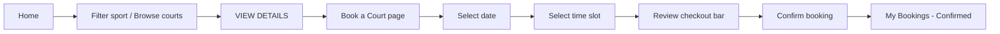
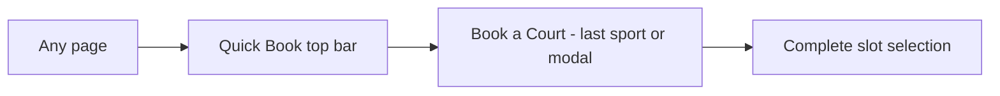
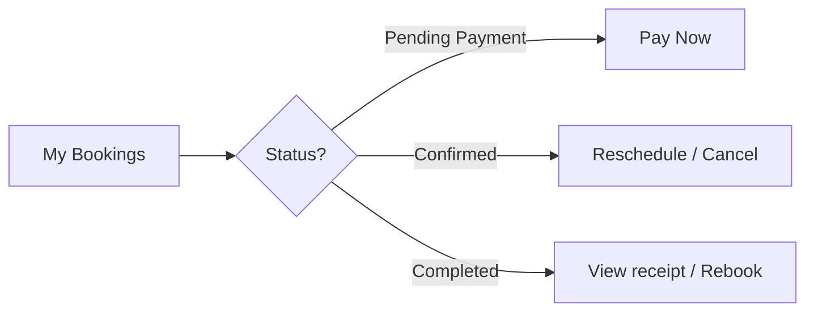
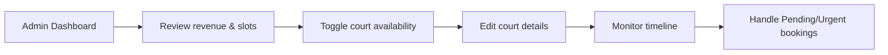

# SI-BLO — Design Handoff & Implementation Prompt

> **Audience:** Front-end developers, back-end developers, and QA.  
> **Author perspective:** UI/UX developer handing off the Figma design for implementation.  
> **Figma source:** [SI-BLO Web Design](https://www.figma.com/design/l1fNsfJTZgSQumwF6DqmKu/Untitled?node-id=0-1)  
> **Backend target:** Spring Boot (`com.siblo.rent`) — Java 25.

---

## 1. Product summary

**SI-BLO** (tagline: *Pro Court Rentals*) is a sports court rental platform. Users discover courts by sport, view details, book time slots, and manage reservations. Admins manage courts, availability, and daily bookings.

### Core user roles

| Role | Access |
|------|--------|
| **Guest / Member** | Home, search, book courts, view own bookings |
| **Admin** | All member features + Admin Management dashboard |

### Routes (information architecture)

| Route | Screen name | Primary goal |
|-------|-------------|--------------|
| `/` | Home | Discover courts, filter by sport, view featured listings |
| `/booking` | Book a Court | Select court → date → time → confirm payment |
| `/my-bookings` | My Bookings | Track upcoming & past reservations |
| `/manage-admin` | Admin Management | Manage courts, view revenue, booking timeline |

---

## 2. Design system

### 2.1 Color palette

Implement as CSS variables / design tokens. Use exact hex values from Figma.

| Token name | Hex | Usage |
|------------|-----|--------|
| `--color-bg-primary` | `#081425` | Page background, hero gradient base |
| `--color-bg-sidebar` | `#040e1f` | Left sidebar background |
| `--color-bg-elevated` | `#1f2a3c` | Icon containers, avatar fallback, court thumbnails |
| `--color-bg-card` | `rgba(255,255,255,0.05)` | Glass cards (with backdrop blur) |
| `--color-accent-primary` | `#c3f400` | Primary CTA, active nav, highlights, stats |
| `--color-accent-primary-text` | `#161e00` | Text on lime buttons/badges |
| `--color-accent-secondary` | `#ff5e07` | Notification dot, "TOP RATED" badge |
| `--color-accent-warm` | `#ffb59a` | Open slots stat number |
| `--color-accent-green-muted` | `#abd600` | Positive trend text ("12% from yesterday") |
| `--color-text-primary` | `#ffffff` | Headings, primary body on dark |
| `--color-text-secondary` | `#c4c9ac` | Subtitles, labels, inactive nav |
| `--color-text-tertiary` | `#d8e3fb` | Card button text, user name, table data |
| `--color-border-subtle` | `rgba(255,255,255,0.05)` | Sidebar dividers, section borders |
| `--color-border-default` | `rgba(255,255,255,0.1)` | Card borders, outlined buttons |
| `--color-border-accent` | `rgba(195,244,0,0.2)` | Support button border, accent outlines |
| `--color-border-accent-strong` | `rgba(195,244,0,0.3)` | Admin avatar ring |

**Gradients**

- Hero / court images: `linear-gradient(to top, #081425 0%, rgba(8,20,37,0) 100%)` overlay on photo
- Page base: solid `#081425` (some frames use `#040e1f` for footer)

### 2.2 Typography

| Role | Font | Weight | Size | Line height | Letter spacing | Notes |
|------|------|--------|------|-------------|----------------|-------|
| Display / Hero | **Anybody** | Extrabold (800) | 40px | 50px | -0.8px | "OWN THE COURT" |
| H1 / Brand | **Anybody** | Bold | 32px | 36px | -1.6px (logo), -0.32px (sections) | Uppercase for logo |
| H2 / Section | **Anybody** | Bold | 32px | 36px | -0.32px | "CHOOSE YOUR SPORT", "PREMIUM COURTS" |
| H3 / Card title | **Anybody** or **Hanken Grotesk** | Bold | 24px | 28px | — | Court names, section titles |
| H4 | **Hanken Grotesk** | Bold | 18–24px | 28px | — | Admin court names |
| Body large | **Hanken Grotesk** | Regular | 18px | 28px | — | Hero description |
| Body default | **Hanken Grotesk** | Regular / Medium | 16px | 24px | — | Card subtitles |
| Body small | **Hanken Grotesk** | Medium | 12px | 16px | — | Location counts, meta |
| Label / Nav | **Hanken Grotesk** | Semibold | 14px | 20px | 0.7px | Sidebar links, footer links |
| Stat number | **Hanken Grotesk** | Extrabold | 40px | 44px | -0.8px | 12K+, 450+, 98% |
| Stat label | **Hanken Grotesk** | Bold | 14px | 20px | 1.4px | Uppercase two-line labels |
| Badge / Pill | **Hanken Grotesk** | Bold | 12px | 16px | 1.2px | Uppercase pills |
| Micro | **Hanken Grotesk** | Bold | 10px | 15px | 1px / -0.5px | PREMIUM tag, +8k avatar |

**Font loading:** Google Fonts — `Anybody`, `Hanken Grotesk`.

### 2.3 Spacing scale (from Figma)

Use an 4px base grid. Common values observed:

| Token | Value | Usage |
|-------|-------|--------|
| `--space-1` | 4px | Badge padding, stat gap |
| `--space-2` | 8px | Icon gaps, nav item internal gap |
| `--space-3` | 12px | Nav padding, small gaps |
| `--space-4` | 16px | Button gaps, card internal spacing |
| `--space-5` | 24px | Section padding, card padding |
| `--space-6` | 32px | Top bar padding, grid gaps |
| `--space-7` | 48px | Section horizontal padding, hero padding |
| `--space-8` | 64px | Section vertical padding |

### 2.4 Border radius

| Token | Value | Usage |
|-------|-------|--------|
| `--radius-sm` | 8px | Social icons, small containers |
| `--radius-md` | 12px | Buttons, nav items, court icon boxes |
| `--radius-lg` | 16px | Sport category cards, stat cards, admin rows |
| `--radius-xl` | 24px | Premium court cards, large stat cards |
| `--radius-pill` | 9999px | Badges, avatars, search bar, toggles |

### 2.5 Effects

| Effect | Spec | Usage |
|--------|------|--------|
| Glass card | `backdrop-filter: blur(10px)` + `bg rgba(255,255,255,0.05)` + border `rgba(255,255,255,0.1)` | Category cards, court cards, stats |
| Sidebar blur | `backdrop-filter: blur(12px)` | Aside navigation |
| Shadow (sidebar) | `0 25px 50px -12px rgba(0,0,0,0.25)` | Sidebar elevation |
| Shadow (bottom nav) | Present on mobile BottomNavBar | Fixed mobile navigation |
| Accent glow | `0 0 8px rgba(195,244,0,0.4)` | Progress bar fill (System Health) |

---

## 3. Component library

### 3.1 Buttons

#### Primary (filled lime)

- **Background:** `#c3f400`
- **Text:** `#161e00`, Bold
- **Border radius:** 12px (hero: 12px; top bar pill: 9999px)
- **Padding:** Hero `40px 16px`; Top bar `8px 24px`; Admin "Add Court" `8px 16px`
- **Labels:** `BOOK NOW`, `Quick Book`, `Add Court`
- **Hover (implement):** Slightly darken lime or add subtle scale; not in Figma — use `#b8e600`
- **Disabled:** 50% opacity, no pointer

#### Secondary (outlined / ghost)

- **Background:** `rgba(255,255,255,0.05)` + blur
- **Border:** `rgba(255,255,255,0.2)` or `rgba(255,255,255,0.1)`
- **Text:** `#ffffff` or `#d8e3fb`, Bold 16px
- **Labels:** `EXPLORE MAP`, `VIEW DETAILS`
- **Padding:** `17px` vertical (VIEW DETAILS), `33px 17.5px` (EXPLORE MAP)

#### Support (outlined accent)

- **Border:** `#c3f400` or `rgba(195,244,0,0.2)`
- **Text:** `#c3f400`, Semibold 14px
- **Icon:** Help/support icon left of label
- **Padding:** `13px` vertical

#### Destructive / Icon-only (admin)

- Edit button: outlined, icon + "Edit" text
- Delete button: 48×48 icon-only square, trash icon

#### Checkout CTA (booking page)

- Large primary button in bottom checkout bar (~311×88px desktop)
- Includes icon + confirmation text (e.g. confirm booking)
- Paired with secondary action button (~154×82px) — likely "Save" or calendar add

### 3.2 Badges & status pills

| Badge | Background | Text | Example |
|-------|------------|------|---------|
| Available | `#c3f400` | `#161e00` | AVAILABLE |
| Top rated | `#ff5e07` | `#ffffff` | TOP RATED |
| Scarcity | `#c3f400` | `#161e00` | 2 SLOTS LEFT |
| Live status | `rgba(195,244,0,0.1)` + border `rgba(195,244,0,0.2)` | `#c3f400` | AVAILABLE NOW: 42 COURTS |
| Premium tag | `rgba(195,244,0,0.2)` | `#c3f400` 10px uppercase | PREMIUM |
| Maintenance | (muted/warning — implement orange or gray) | white | MAINTENANCE |
| Booking: Confirmed | green dot + label | — | Past/upcoming tables |
| Booking: Pending | gray/white dot | `#c4c9ac` | Timeline & cards |
| Booking: Active | green indicator | — | Admin timeline |
| Booking: Urgent | (highlight — implement orange/red) | — | Admin timeline |

All badges: `border-radius: 9999px`, padding `4px 12px`, font 12px Bold uppercase.

### 3.3 Cards

#### Sport category card

- Size: ~166×161px (5-column grid on desktop)
- Glass background, 16px radius
- Top: 48×48 icon container (`#2a3548`, 12px radius)
- Title: sport name, 24px Bold white
- Subtitle: "X Locations", 12px `#c4c9ac`
- Optional bottom accent border (4px transparent on sides — selected state uses lime bottom border on one card in grid)

#### Premium court card

- Width: ~288px (3-column grid), total height ~416px, radius 24px
- Image area: 256px height with gradient overlay
- Floating badge top-right on image
- Location row: pin icon + uppercase venue name in `#c3f400`
- Court name: 24px Bold white (may wrap 2 lines)
- Meta row: capacity icon + "X Max", star icon + rating, price in `#c3f400` + "/hr" in muted
- CTA: full-width outlined `VIEW DETAILS` button

#### Booking card (mobile my-bookings)

- Full-width ~350px, image header + content body
- Status badge overlay (Confirmed / Pending Payment / Completed)
- Court name heading (e.g. "City Stadium - Court 4")
- Date + time rows with calendar/clock icons
- Action buttons at bottom (2 buttons per card — e.g. Reschedule / Cancel or Pay Now)

#### Admin court row

- Horizontal layout: 128×80 thumbnail | info | availability toggle | actions
- Thumbnail: rounded 12px, gradient overlay
- Toggle: 44×24 pill, lime when ON, white knob

### 3.4 Form inputs

#### Search bar (desktop top nav)

- Container: ~384×58px, pill-like rounded container
- Background: `Background+Border` (dark with border)
- Left: magnifying glass icon 18×18
- Placeholder: `"Search courts, locations, or sports..."` — 16px, muted
- Admin variant placeholder: `"Search bookings, courts or users..."`
- My Bookings variant: `"Search bookings..."`

#### Date picker (booking)

- **Mobile:** horizontal scroll of date cards, each ~64×96px with shadow
- **Desktop:** "Horizontal Date Scroller" in right column (~480px wide)
- Selected date: lime border/background highlight (implement clear selected vs default state)

#### Time slot grid

- Grid of slot buttons ~111×58px each
- States to implement:
  - **Available:** outlined glass, white text
  - **Selected:** lime fill, dark text
  - **Unavailable:** disabled, reduced opacity, no click
  - **Booked:** distinct muted style

### 3.5 Toggle switch (admin availability)

- Track: 44×24px, `#c3f400` when active
- Knob: 20×20px white circle, positioned right when ON
- Label above: "AVAILABILITY" 10px uppercase `#c4c9ac`

### 3.6 Navigation

#### Desktop sidebar (256px fixed)

```
┌─────────────────────┐
│ SI-BLO              │  ← Anybody 32px #c3f400 uppercase
│ Pro Court Rentals   │  ← 12px #c4c9ac 70% opacity
├─────────────────────┤
│ ● Home              │  ← active: lime bg #c3f400, text #161e00
│   Book a Court      │  ← inactive: text #c4c9ac + icon
│   My Bookings       │
│   Admin Management  │
├─────────────────────┤
│ [ Support ]         │  ← outlined accent button
│ (avatar) John Doe   │
│         PREMIUM MEMBER│
└─────────────────────┘
```

- Nav item: 207×44–46px, 12px radius when active
- Icons: 15–20px, left of label, 12px gap
- Active item has slight scale transform (0.97) in Figma — optional micro-interaction

#### Desktop top bar (80px height)

- Left area: occupied by main content offset (sidebar is separate)
- Search input (left portion of content area)
- Right cluster:
  1. **Notification bell** — icon 16×20, orange dot `#ff5e07` 8×8 top-right
  2. **Messages / secondary icon** — 20×20
  3. **Quick Book** — lime pill button, Bold 14px `#161e00`

#### Mobile top app bar (64px)

- Compact header with back/menu as needed
- Page title centered or left-aligned

#### Mobile bottom nav bar (80–81px)

- Fixed bottom, shadow elevation
- 4–5 icons mirroring sidebar routes
- Active tab: lime accent on icon/label

### 3.7 Tables

Used on Past Bookings (desktop) and Admin Booking Timeline.

- Header row: 54px height, labels uppercase or semibold 16px
- Columns (Past Bookings): Court | Date | Time | Status | Actions
- Columns (Timeline): TIME | USER | COURT | STATUS
- Row height: ~83px
- Row actions: icon buttons (view, download, etc.)
- Footer link: "View Full Schedule" centered, `#c4c9ac` Bold 14px

### 3.8 Avatar

- Size: 40×40px circle
- Border: 2px `#081425` (stacked community avatars) or `rgba(195,244,0,0.3)` (profile)
- Overflow count badge: lime circle with "+8k" in `#161e00`

### 3.9 Icons (inventory)

All icons are SVG/vector in Figma. Front-end should use a consistent icon set (Lucide, Heroicons, or exported SVGs).

| Context | Icon description |
|---------|------------------|
| Sidebar Home | House / home |
| Book a Court | Sport/court or calendar |
| My Bookings | List / ticket |
| Admin Management | Settings / shield |
| Support | Life ring / help |
| Search | Magnifying glass |
| Notifications | Bell |
| Quick Book | (button text only) |
| Explore Map | Map pin / map |
| Location pin | Map marker (court cards) |
| Capacity | Users / people |
| Rating | Star |
| Carousel | Chevron left / right |
| Social footer | Two social icons in 40×40 glass buttons |
| Edit admin | Pencil |
| Delete admin | Trash |
| Date/time booking | Calendar, clock |
| Checkout | Checkmark or lock |

---

## 4. Layout & responsive breakpoints

| Breakpoint | Width | Layout behavior |
|------------|-------|-----------------|
| **Mobile** | 390px | Single column, TopAppBar + BottomNavBar, stacked cards |
| **Tablet** | 800px | Hybrid — some pages show wider cards, bottom nav may persist |
| **Desktop** | 1280px | Sidebar 256px + content 1024px |
| **Admin desktop** | up to ~1499px | Wider content area for dashboard grid |

### Desktop content grid

- Main content starts at `left: 256px` (after sidebar)
- Horizontal padding: 48px (`px-12`)
- Section vertical padding: 64px
- Max content width within area: 1024px

### Z-index layers (recommended)

1. Base content
2. Sticky top bar (80)
3. Sidebar (90)
4. Bottom checkout bar / mobile bottom nav (100)
5. Modals / toasts (200)

---

## 5. Page specifications

### 5.1 Home (`/`)

**Frame:** `Home - SI-BLO Desktop` (1280×2214)

#### Section A — Hero (600px height)

| Element | Spec |
|---------|------|
| Background | Full-bleed court photo, 60% opacity, gradient overlay bottom-up |
| Status pill | Dot 8px lime + "AVAILABLE NOW: 42 COURTS" |
| Headline line 1 | "OWN THE" — white 40px Extrabold |
| Headline line 2 | "COURT" — `#c3f400` 40px |
| Subcopy | 3 lines, 18px `#c4c9ac`, max-width ~512px |
| Primary CTA | `BOOK NOW` — lime button, 24px Bold, px-40 py-16 |
| Secondary CTA | `EXPLORE MAP` — ghost + map icon |

**Interactions**

- `BOOK NOW` → navigate to `/booking` (or open sport filter modal — recommend `/booking`)
- `EXPLORE MAP` → map view / filtered search (future; can anchor to `#courts` initially)

#### Section B — Choose Your Sport

| Element | Spec |
|---------|------|
| Title | "CHOOSE YOUR SPORT" |
| Subtitle | "Filter by athletic discipline" |
| Carousel controls | Two circular ghost buttons (chevron icons) |
| Cards | Basketball (12), Futsal (8), Padel (15), Badminton (6), Tennis (4) |

**Interaction:** Clicking a sport filters the Premium Courts grid (and search). Pass `?sport=basketball` query param.

#### Section C — Premium Courts

| Element | Spec |
|---------|------|
| Title | "PREMIUM COURTS" |
| Subtitle | "Vetted for professional performance standards" |
| Grid | 3 columns, 32px gap |

**Sample data (from design)**

| Court | Venue | Badge | Capacity | Rating | Price |
|-------|-------|-------|----------|--------|-------|
| Skyline Hoops Premium | DOWNTOWN ARENA | AVAILABLE | 10 Max | 4.9 (128) | Rp199K/hr |
| Velocity Padel Center | GLASS HUB | TOP RATED | 4 Max | 5.0 (89) | Rp260K/hr |
| Striker Futsal Indoor | EAST SIDE COMPLEX | 2 SLOTS LEFT | 12 Max | 4.7 (215) | Rp255K/hr |

**Interaction:** `VIEW DETAILS` → `/booking?courtId={id}`

#### Section D — Stats & Community

| Stat | Value | Label color |
|------|-------|-------------|
| 12K+ | lime | ACTIVE PLAYERS (white label) |
| 450+ | white | PREMIUM COURTS (muted label) — **featured card** has lime top border 4px |
| 98% | lime | USER SATISFACTION |

Community block:

- Title: "JOIN THE ELITE"
- Body: 4-line description about athletes and facilities
- Avatar stack: 4 photos + "+8k" lime badge

#### Section E — Footer

- Brand: "SI-BLO" lime 24px
- Copyright: "© 2024 Pro Court Rentals Ecosystem. All Rights Reserved."
- Links: Privacy Policy | Terms of Service | Help Center | Contact Us
- Social: 2 icon buttons 40×40 glass squares

---

### 5.2 Book a Court (`/booking`)

**Frames:** `Book a Court - SI-BLO Desktop`, mobile `Book a Court` (390×1010)

#### Mobile flow (primary UX)

1. **Court detail hero** (~293px)
   - Example: **Grand Slam Center - Court 04**
   - Badge on image (e.g. Premium)
   - Description: "Premium professional acrylic surface with advanced shock absorption..."

2. **Date picker section** (~148px)
   - Horizontal scroll date cards

3. **Time slots grid** (~312px)
   - Section label: SELECT TIME (implement explicitly)
   - Grid of hourly slots

4. **Sticky booking actions** (~89px, bottom)
   - Price summary + primary book button

#### Desktop layout

- **Left column:** Court details card with image, DESCRIPTION section, amenities
- **Right column:** Date & Time Selector — horizontal date scroller + time grid
- **Footer checkout bar** (137px, fixed bottom of content)

**Checkout bar contents (desktop)**

| Zone | Content |
|------|---------|
| Summary 1 | Selected date label + value |
| Divider | Vertical 1px |
| Summary 2 | Duration (e.g. "2 Hours") |
| Divider | |
| Price | **Rp500.000** total |
| Summary 3 | Court / slot detail text |
| Actions | Secondary button (icon + label) + large primary confirm button |

#### Sample court detail copy (desktop)

> "Experience championship-grade play on our elite Court 04. Featuring a high-performance acrylic surface designed for consistent ball bounce and player comfort. Equipped with stadium-quality LED lighting and climate control..."

**Backend needs:** courts, availability API by date, slot reservation, price calculation.

---

### 5.3 My Bookings (`/my-bookings`)

**Frame:** `My Bookings - SI-BLO Desktop` (1280×1230)

#### Desktop

**Header stats row**

| Card | Label | Sample value |
|------|-------|--------------|
| Left | THIS MONTH | 12 |
| Right | UPCOMING | 3 |

**Upcoming Matches (bento grid)**

- Section title: "Upcoming Matches" with lime underline 48×4px
- Link: "View All" with chevron (top right)
- 3 cards in row; third card is **empty state CTA**:
  - Icon in circle
  - "Book Another"
  - Description text (~3 lines)
  - CTA button

**Past Bookings table**

- Title: "Past Bookings"
- Sample rows:
  - Oct 15, 2023 — 20:00–21:00
  - Oct 10, 2023 — 10:00–12:00
- Status column with colored dot
- Action icons per row

#### Mobile

- Title: **Your Bookings**
- Subtitle: "Keep track of your games and upcoming sessions."
- Stats bento (THIS MONTH / UPCOMING)
- **Upcoming** section with cards:
  - Booking Card: **Confirmed**
  - Booking Card: **Pending Payment**
- **Past** section:
  - Booking Card: **Completed**

**Booking statuses (enum for backend)**

```
CONFIRMED | PENDING_PAYMENT | COMPLETED | CANCELLED | ACTIVE (admin)
```

---

### 5.4 Admin Management (`/manage-admin`)

**Frame:** `Manage Courts (Admin) - SI-BLO Desktop` (1499×1217)

**Role:** Admin only. Sidebar shows "Admin User / System Master" instead of "John Doe / PREMIUM MEMBER".

#### Dashboard stats row (3 cards)

| Metric | Value | Subtext | Accent |
|--------|-------|---------|--------|
| TODAY'S REVENUE | Rp51.250.000 | 12% from yesterday ↑ | lime text + lime icon bg |
| ACTIVE BOOKINGS | 30 | 85% Capacity | white text |
| OPEN SLOTS | 12 | Next available: 2:00 PM | `#ffb59a` number |

#### Manage Courts list (left 2/3 grid)

- Header: "Manage Courts" + **Add Court** lime button
- Rows:

| Court | Type | Price | Status |
|-------|------|-------|--------|
| Lapangan Futsal | Indoor • Hard Court | Rp255.000/hr | PREMIUM, toggle ON |
| Lapangan Voli | Outdoor • Clay | Rp150.000/hr | toggle ON |
| Lapangan Padel | Indoor • Synthetic | Rp135.000/hr | MAINTENANCE, toggle OFF |

- Each row actions: **Edit** (text button) + **Delete** (icon)

#### Booking Timeline (right 1/3)

- Title: "Booking Timeline"
- Subheader: "Schedule - Today" | "Oct 12, 2023"
- Live table with statuses: Active, Pending, Urgent
- Sample users: M. Jordan #4022, S. Williams #3912, etc.
- Footer: "View Full Schedule"

#### System Health card

- Server Uptime: 99.9% (progress bar lime)
- API Response: 24ms (progress bar)

#### Admin footer

- "© 2023 SI-BLO Court Management System • V2.4.1 Admin Console"

---

## 6. User flows (recommended)

### Flow 1 — First-time booking (happy path)



### Flow 2 — Return user quick book



### Flow 3 — Manage existing booking



### Flow 4 — Admin daily operations



---

## 7. Back-end specification (for Spring Boot)

### 7.1 Suggested domain entities

```
User { id, name, email, role: MEMBER|ADMIN, membershipTier }
Sport { id, name, slug, icon, locationCount }
Venue { id, name, address, zone }
Court { id, venueId, sportId, name, description, surfaceType, indoor, pricePerHour, capacity, rating, reviewCount, status: ACTIVE|MAINTENANCE|INACTIVE, images[] }
TimeSlot { id, courtId, date, startTime, endTime, status: AVAILABLE|BOOKED|BLOCKED }
Booking { id, userId, courtId, slotIds[], date, startTime, endTime, totalPrice, status, createdAt }
Payment { id, bookingId, amount, status, method }
```

### 7.2 REST API endpoints (minimum viable)

| Method | Endpoint | Purpose |
|--------|----------|---------|
| GET | `/api/sports` | List sports with location counts |
| GET | `/api/courts?sport=&search=&featured=` | Search/filter courts |
| GET | `/api/courts/{id}` | Court detail |
| GET | `/api/courts/{id}/availability?date=` | Time slots for date |
| POST | `/api/bookings` | Create booking |
| GET | `/api/bookings/me?upcoming=&past=` | User bookings |
| PATCH | `/api/bookings/{id}` | Reschedule / cancel |
| POST | `/api/bookings/{id}/pay` | Complete pending payment |
| GET | `/api/admin/stats/dashboard` | Revenue, active bookings, open slots |
| GET | `/api/admin/courts` | Admin court list |
| POST | `/api/admin/courts` | Add court |
| PUT | `/api/admin/courts/{id}` | Edit court |
| PATCH | `/api/admin/courts/{id}/availability` | Toggle availability |
| DELETE | `/api/admin/courts/{id}` | Delete court |
| GET | `/api/admin/bookings/timeline?date=` | Schedule table |

### 7.3 Business rules

- Prices stored in **IDR** (integer rupiah). UI abbreviates (Rp199K = Rp199.000).
- Slot duration default: **1 hour**; checkout example uses **2 hours → Rp500.000**.
- Prevent double-booking: transactional slot lock on confirm.
- `PENDING_PAYMENT` expires after configurable timeout (e.g. 15 min).
- Admin `MAINTENANCE` status forces court toggle OFF and hides from public search.
- "42 courts available" on home = live count of courts with ≥1 open slot today.

### 7.4 Auth

- JWT or session-based auth
- Role guard: `/manage-admin` and `/api/admin/**` require `ADMIN`
- Sidebar profile: return `name`, `membershipTier` (e.g. PREMIUM MEMBER)

---

## 8. Front-end implementation notes

### 8.1 Recommended stack (align with project)

- **Backend:** Spring Boot 4.1 REST + Spring Security
- **Front-end options:**
  - Thymeleaf + HTMX (server-rendered, matches current bare Spring project)
  - OR separate React/Vue SPA served by Spring static resources
  - OR Spring Boot + Tailwind (Figma export uses Tailwind classes as reference — convert to your CSS approach)

### 8.2 Component mapping

| Figma component | React/Vue component suggestion |
|-----------------|--------------------------------|
| Aside - Side Navigation Bar | `<AppSidebar />` |
| Header - Top Navigation Bar | `<TopNav />` |
| Sport category card | `<SportCategoryCard />` |
| Court Card 1/2/3 | `<CourtCard />` |
| Date Cards | `<DateScroller />` |
| Time Slots Grid | `<TimeSlotGrid />` |
| Footer - Bottom Checkout Bar | `<BookingCheckoutBar />` |
| Booking Card variants | `<BookingCard status="" />` |
| Dashboard Stats Row | `<StatCard />` |
| Manage Courts List row | `<AdminCourtRow />` |

### 8.3 State management

- **Booking flow:** local state for selected court → date → slots → price; submit on confirm
- **Filters:** URL query params (`sport`, `search`, `date`)
- **Admin toggles:** optimistic UI with rollback on API error

### 8.4 Accessibility

- All icon-only buttons need `aria-label`
- Time slots: keyboard navigable grid, `aria-selected` for chosen slot
- Toggle switches: associate with `<label>` and `role="switch"`
- Color contrast: lime `#c3f400` on white passes; on `#081425` use white text
- Focus rings: add visible focus (2px lime outline) — not in Figma but required

---

## 9. Recommended development workflow

Build in vertical slices so design, API, and UI stay testable end-to-end.

### Phase 0 — Foundation (Week 1)

1. Set up design tokens (CSS variables) from Section 2
2. Load fonts (Anybody, Hanken Grotesk)
3. Build layout shell: `<AppShell>` with sidebar, top nav, responsive breakpoints
4. Implement static Home page (no API) with mock data
5. Backend: project structure, H2/PostgreSQL, base entities

### Phase 1 — Discovery & catalog (Week 2)

1. API: sports, courts list, court detail
2. Home: hero, sport filter, premium courts grid from API
3. Search bar wired to `/api/courts?search=`
4. `VIEW DETAILS` navigation with court ID

### Phase 2 — Booking flow (Week 3)

1. API: availability by date, create booking, price calculation
2. Book a Court page: date scroller + time slot grid
3. Checkout bar with live total
4. Confirmation → redirect to My Bookings

### Phase 3 — My Bookings (Week 4)

1. API: list upcoming/past, cancel, reschedule, pay
2. Desktop bento grid + past table
3. Mobile booking cards with status variants
4. Empty state "Book Another" CTA

### Phase 4 — Admin dashboard (Week 5)

1. API: admin stats, CRUD courts, timeline
2. Dashboard stats row
3. Manage courts list with toggles
4. Booking timeline table
5. System health (can be static initially)

### Phase 5 — Polish (Week 6)

1. Mobile bottom nav + responsive QA on 390 / 800 / 1280
2. Loading skeletons (glass card placeholders)
3. Error toasts, form validation
4. Notification bell (optional MVP: static dot)
5. E2E tests for booking happy path

### Definition of done (per screen)

- [ ] Matches Figma spacing, colors, typography within 2px tolerance
- [ ] Responsive at mobile, tablet, desktop breakpoints
- [ ] All buttons wired to correct routes/actions
- [ ] API integrated with loading and error states
- [ ] Empty states implemented (no bookings, no slots)
- [ ] Role-based access enforced on admin routes

---

## 10. Sample content & copy deck

Use for seed data and placeholders.

| Key | Copy |
|-----|------|
| brand.name | SI-BLO |
| brand.tagline | Pro Court Rentals |
| hero.badge | AVAILABLE NOW: 42 COURTS |
| hero.title | OWN THE COURT |
| hero.subtitle | Experience professional-grade sports facilities tailored for your performance. From midnight hoops to morning padel sessions, book your victory today. |
| cta.primary | BOOK NOW |
| cta.secondary | EXPLORE MAP |
| cta.quickBook | Quick Book |
| cta.viewDetails | VIEW DETAILS |
| cta.addCourt | Add Court |
| section.sports | CHOOSE YOUR SPORT |
| section.courts | PREMIUM COURTS |
| section.community | JOIN THE ELITE |
| footer.copyright | © 2024 Pro Court Rentals Ecosystem. All Rights Reserved. |
| user.sample | John Doe / PREMIUM MEMBER |
| admin.sample | Admin User / System Master |

---

## 11. Figma file structure reference

| Section node | Route | Desktop frame |
|--------------|-------|---------------|
| `Home` | `/` | Home - SI-BLO Desktop |
| `/my-bookings` | `/my-bookings` | My Bookings - SI-BLO Desktop |
| `/booking` | `/booking` | Book a Court - SI-BLO Desktop |
| `/manage-admin` | `/manage-admin` | Manage Courts (Admin) - SI-BLO Desktop |

Mobile variants exist inside each section (`Home - CourtFlow` 390px, `Book a Court` 390px, etc.).

---

## 12. Open questions for product owner

1. Is **EXPLORE MAP** in scope for MVP or defer to Phase 2?
2. Payment gateway integration (Midtrans, Xendit) or manual **Pending Payment** only?
3. Can users **reschedule** freely or admin-only?
4. Multi-hour slot selection — consecutive slots only?
5. Auth provider — email/password, Google SSO, or university SSO?

---

*This document is the single source of truth for implementing SI-BLO from the Figma design. Update it when the design or API contract changes.*
