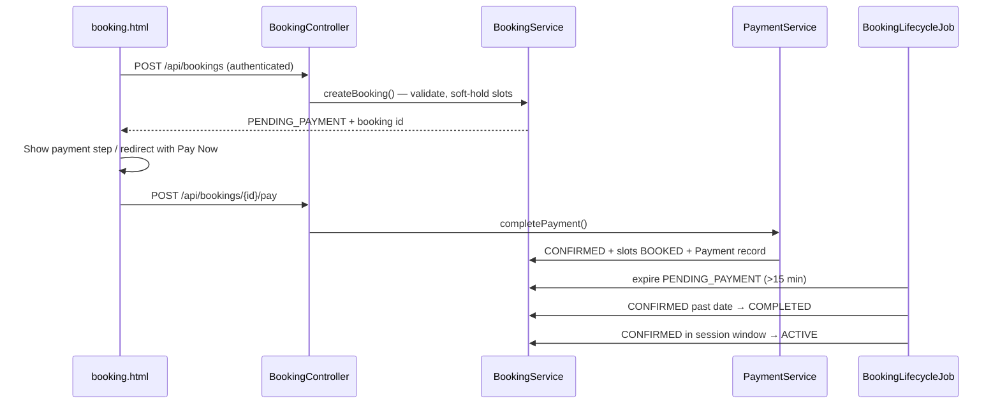

# SI-BLO Booking System — Complete Fix Prompt

> **Audience:** Developers or AI agents implementing fixes in this repository.  
> **Project:** Spring Boot 3.4 (`com.siblo.rent`) + Thymeleaf + JWT + H2  
> **Companion docs:** `Prompt.md` (design spec), `db_siblo.sql` (schema reference)  
> **Goal:** Make the booking system production-correct: secure, validated, transactional, and aligned with `Prompt.md` §7.3 business rules.

---

## 1. Problem statement

The booking flow has the right skeleton (court → date → slots → booking → pay/cancel → my bookings) but fails in practice due to:

| Area | Symptom |
|------|---------|
| Security | `/api/bookings/**` is effectively public (`SecurityConfig` → `anyRequest().permitAll()`) |
| Slot locking | Slots marked `BOOKED` on create while booking is `PENDING_PAYMENT`; no expiry → orphaned locks |
| Validation | Slots from wrong court/date accepted; start/end times wrong when selection order ≠ chronological |
| Concurrency | `@Version` on `TimeSlot` unused; double-booking possible under race |
| Payment | `payments` table exists in SQL but no Java entity/service; `payBooking()` is a one-line status flip |
| Lifecycle | `ACTIVE` and `COMPLETED` never set; past `CONFIRMED` bookings stay "upcoming" forever |
| Reschedule | UI button exists; backend and `booking.html` ignore `?reschedule=` |
| Data | `DataSeeder` bookings have no `slotIds`; new courts get no slots on create |
| UX | `booking.html` says "Booking confirmed!" when status is `PENDING_PAYMENT`; weak fetch error handling |

**Do not** redesign the UI or add new frameworks. Fix behavior inside the existing stack and file layout.

---

## 2. Constraints

1. **Minimize scope creep** — fix booking correctness; do not refactor unrelated pages unless listed below.
2. **Match existing conventions** — same package layout, DTO pattern, `RuntimeException` → controller catch (upgrade to proper exceptions where specified).
3. **IDR integers** — prices stay as `Integer` rupiah (e.g. `350000` = Rp350K).
4. **Slot duration** — 1 hour per slot; contiguous multi-hour bookings allowed.
5. **Auth** — keep JWT via `Authorization: Bearer <token>` from `localStorage`.
6. **Database** — H2 in-memory with `ddl-auto=create-drop`; update `DataSeeder` and optionally `db_siblo.sql` for consistency.
7. **No real payment gateway** — simulate pay with `POST /api/bookings/{id}/pay`; record a `Payment` row with status `COMPLETED`.
8. **Tests** — add focused integration/unit tests for the critical paths listed in §10.

---

## 3. Target architecture (after fix)



### Slot hold strategy (implement this)

Add `HELD` to `TimeSlot.SlotStatus` enum: `AVAILABLE | HELD | BOOKED | BLOCKED`.

| Phase | Slot status | Booking status |
|-------|-------------|----------------|
| User confirms booking | `HELD` | `PENDING_PAYMENT` |
| Payment succeeds | `BOOKED` | `CONFIRMED` |
| Payment expires / cancel while pending | `AVAILABLE` | `CANCELLED` |
| Cancel confirmed (allowed window) | `AVAILABLE` | `CANCELLED` |

Add to `Booking` entity:

```java
@Column(name = "payment_expires_at")
private LocalDateTime paymentExpiresAt;
```

Configurable via `application.properties`:

```properties
app.booking.payment-timeout-minutes=15
app.booking.cancel-cutoff-hours=24
```

---

## 4. Implementation phases

Execute in order. Each phase must compile and pass tests before moving on.

---

### Phase 1 — Security & error handling

#### 4.1.1 `SecurityConfig.java`

Replace the catch-all `permitAll()` for booking routes:

```java
.requestMatchers("/api/bookings/**").authenticated()
.requestMatchers("/manage-admin", "/api/admin/**").hasRole("ADMIN")
.anyRequest().permitAll()
```

Keep public: `/`, `/home`, `/login`, `/booking` (page only), `/my-bookings` (page only), `/api/auth/**`, `/api/sports/**`, `/api/courts/**`, static assets.

#### 4.1.2 Exception handling

Create `com.siblo.rent.exception` package:

| Class | HTTP | When |
|-------|------|------|
| `BookingException` (base) | 400 | Business rule violation |
| `UnauthorizedException` | 403 | User doesn't own booking |
| `ResourceNotFoundException` | 404 | Court/booking/slot not found |
| `SlotNotAvailableException` | 409 | Slot taken or not AVAILABLE |

Create `GlobalExceptionHandler` (`@RestControllerAdvice`):

- Map exceptions → `{ "error": "message" }` JSON
- `AuthenticationException` / missing auth → 401
- `AccessDeniedException` → 403
- Never return 500 for expected business failures

#### 4.1.3 `BookingController.java`

- Remove try/catch around service calls; let `GlobalExceptionHandler` handle them
- `getMyBookings`: if `auth == null` → 401 (should not happen after security fix, but guard anyway)
- Support query params per spec:
  - `GET /api/bookings/me?upcoming=true` → future bookings with status `CONFIRMED`, `PENDING_PAYMENT`, or `ACTIVE`
  - `GET /api/bookings/me?past=true` → `COMPLETED`, `CANCELLED`, or past-date `CONFIRMED`

---

### Phase 2 — Domain model & repositories

#### 4.2.1 `TimeSlot.java`

- Add `HELD` to `SlotStatus`
- Keep `@Version` for optimistic locking

#### 4.2.2 `Booking.java`

Add fields:

```java
private LocalDateTime paymentExpiresAt;
private LocalDateTime createdAt;  // change from LocalDate to LocalDateTime if feasible; else keep LocalDate
```

Update `@PrePersist` to set `createdAt = LocalDateTime.now()` and `paymentExpiresAt = now + timeout`.

#### 4.2.3 `Payment` entity (new)

Create `com.siblo.rent.entity.Payment`:

```java
@Entity @Table(name = "payments")
public class Payment {
    @Id @GeneratedValue(strategy = GenerationType.IDENTITY)
    private Long id;
    @OneToOne @JoinColumn(name = "booking_id", nullable = false)
    private Booking booking;
    private Integer amount;
    @Enumerated(EnumType.STRING)
    private PaymentStatus status;  // PENDING, COMPLETED, FAILED, REFUNDED
    private String method;         // e.g. "SIMULATED"
    private LocalDateTime paidAt;
}
```

Create `PaymentRepository`, `PaymentService`, `PaymentDTO` as needed.

#### 4.2.4 `TimeSlotRepository.java`

Add pessimistic lock method for booking flow:

```java
@Lock(LockModeType.PESSIMISTIC_WRITE)
@Query("SELECT t FROM TimeSlot t WHERE t.id IN :ids ORDER BY t.startTime")
List<TimeSlot> findAllByIdForUpdate(@Param("ids") List<Long> ids);
```

Add:

```java
List<TimeSlot> findByStatusAndHeldBefore(SlotStatus status, LocalDateTime before); // if tracking heldAt on slot
// OR query bookings with PENDING_PAYMENT and paymentExpiresAt < now
```

#### 4.2.5 `BookingRepository.java`

Fix/add queries:

```java
List<Booking> findByUser_IdOrderByCreatedAtDesc(Long userId);

@Query("SELECT b FROM Booking b WHERE b.user.id = :userId AND b.status IN :statuses AND b.date >= :today ORDER BY b.date, b.startTime")
List<Booking> findUpcoming(@Param("userId") Long userId, @Param("statuses") List<BookingStatus> statuses, @Param("today") LocalDate today);

@Query("SELECT b FROM Booking b WHERE b.user.id = :userId AND (b.status IN ('COMPLETED','CANCELLED') OR (b.status = 'CONFIRMED' AND b.date < :today)) ORDER BY b.date DESC")
List<Booking> findPast(@Param("userId") Long userId, @Param("today") LocalDate today);

List<Booking> findByStatusAndPaymentExpiresAtBefore(BookingStatus status, LocalDateTime expiresAt);
```

---

### Phase 3 — `BookingService` rewrite (core)

Replace `BookingService.java` logic with validated, transactional operations.

#### 4.3.1 `createBooking(BookingRequest request, Long userId)`

**Validation checklist (throw `BookingException` on failure):**

1. `request.courtId`, `request.slotIds`, `request.date` are non-null/non-empty
2. `LocalDate.parse(request.getDate())` must be `>= LocalDate.now()` (no past dates)
3. Court exists and `status == ACTIVE`
4. Load slots via `findAllByIdForUpdate(slotIds)` — count must equal `slotIds.size()` (no phantom IDs)
5. Every slot: `slot.court.id == request.courtId`
6. Every slot: `slot.date == parsedDate`
7. Every slot: `status == AVAILABLE`
8. Sort slots by `startTime` ascending
9. **Contiguous check:** for each adjacent pair, `prev.endTime == next.startTime`
10. Compute `startTime = first.startTime`, `endTime = last.endTime`
11. `totalPrice = slots.size() * court.getPricePerHour()`

**Persist:**

- Set each slot to `HELD` (not `BOOKED`)
- Create booking: `PENDING_PAYMENT`, `paymentExpiresAt = now + timeout`, store sorted `slotIds`
- Return `BookingDTO`

**On `OptimisticLockException`:** throw `SlotNotAvailableException("One or more slots were just booked")`

#### 4.3.2 `payBooking(Long bookingId, Long userId)`

1. Load booking; verify ownership
2. Status must be `PENDING_PAYMENT`
3. `paymentExpiresAt` must be `> now` (else throw "Payment window expired")
4. Load slots by `booking.slotIds`; verify all `HELD`
5. Set slots → `BOOKED`
6. Set booking → `CONFIRMED`
7. Create `Payment`: amount = `totalPrice`, status = `COMPLETED`, method = `SIMULATED`, paidAt = now
8. Return `BookingDTO`

#### 4.3.3 `cancelBooking(Long bookingId, Long userId)`

1. Load booking; verify ownership
2. Allowed statuses:
   - `PENDING_PAYMENT` → always cancel
   - `CONFIRMED` → only if `booking.date.atTime(booking.startTime).isAfter(now.plusHours(cancelCutoffHours))`
   - Reject `COMPLETED`, `CANCELLED`, `ACTIVE`
3. Release slots (`HELD` or `BOOKED` → `AVAILABLE`)
4. If payment exists and was `COMPLETED`, set payment status `REFUNDED` (simulated)
5. Set booking → `CANCELLED`

#### 4.3.4 `rescheduleBooking(Long bookingId, BookingRequest newRequest, Long userId)` (new)

Single `@Transactional` operation:

1. Validate `newRequest` same as `createBooking`
2. Cancel old booking (release old slots) — internal method, no status check if called from reschedule
3. Create new booking with new slots
4. If old was `CONFIRMED`, new booking starts as `CONFIRMED` and slots → `BOOKED` immediately (no re-pay)
5. If old was `PENDING_PAYMENT`, new booking is `PENDING_PAYMENT` with fresh expiry

Expose via:

```java
@PatchMapping("/{id}")
public ResponseEntity<?> updateBooking(@PathVariable Long id, @RequestBody BookingUpdateRequest body, Authentication auth)
```

`BookingUpdateRequest`:

```java
{ "action": "cancel" }
// OR
{ "action": "reschedule", "courtId": 1, "slotIds": [10,11], "date": "2026-06-20" }
```

#### 4.3.5 Query methods

Update `getUserBookings`, `getUpcomingBookings`, add `getPastBookings` using new repository queries.

---

### Phase 4 — Scheduled jobs

Create `com.siblo.rent.scheduler.BookingLifecycleScheduler`:

```java
@Scheduled(fixedRate = 60_000) // every minute
@Transactional
public void processExpiredPayments() {
    // find PENDING_PAYMENT where paymentExpiresAt < now
    // cancel each: release HELD slots, status CANCELLED
}

@Scheduled(cron = "0 */5 * * * *") // every 5 minutes
@Transactional
public void updateBookingLifecycle() {
  LocalDate today = LocalDate.now();
  LocalTime now = LocalTime.now();
  // CONFIRMED where date < today → COMPLETED, release nothing (slots stay BOOKED until day passes then mark AVAILABLE? or leave BOOKED for history)
  // CONFIRMED where date == today AND startTime <= now < endTime → ACTIVE
  // ACTIVE where endTime < now → COMPLETED
}
```

Enable scheduling: `@EnableScheduling` on `RentApplication` or a `SchedulingConfig`.

**Slot cleanup after completed booking:** On transition to `COMPLETED`, set associated slots back to `AVAILABLE` for future dates only if `slot.date` equals booking date (historical record stays in booking table).

---

### Phase 5 — Court & slot generation

#### 4.5.1 `CourtService.addCourt()`

After `courtRepository.save(court)`, call:

```java
generateSlots(court.getId(), 14);
```

#### 4.5.2 Rolling slot window (optional but recommended)

Daily job (or on app startup after seeder):

```java
@Scheduled(cron = "0 0 1 * * *") // 01:00 daily
public void extendSlotHorizon() {
    // For each ACTIVE court, generateSlots(courtId, 14) — method already skips existing slots
}
```

#### 4.5.3 `DataSeeder.java`

Fix seed data consistency:

1. When creating sample bookings, find matching `TimeSlot` rows and set `booking.slotIds`
2. Set slot status to `BOOKED` for confirmed/completed bookings, `HELD` for pending payment
3. Set `paymentExpiresAt` on pending booking to `now + 15 min`
4. Create a sample `Payment` for completed bookings
5. Remove fake `BOOKED` slots that have no booking (day 0 hours 18–20 rule) OR link them to a booking

---

### Phase 6 — Frontend fixes

#### 4.6.1 `booking.html`

**Auth & errors:**

```javascript
async function apiFetch(url, options = {}) {
    const token = localStorage.getItem('token');
    const headers = { 'Content-Type': 'application/json', ...(options.headers || {}) };
    if (token) headers['Authorization'] = 'Bearer ' + token;
    const r = await fetch(url, { ...options, headers });
    const data = await r.json().catch(() => ({}));
    if (r.status === 401) { window.location.href = '/login'; return null; }
    if (!r.ok) throw new Error(data.error || 'Request failed');
    return data;
}
```

**Contiguous slot selection in `toggleSlot(btn)`:**

- After toggling, sort selected slots by `data-start` time
- Verify they form a contiguous range; if not, deselect the outlier and show brief message: "Please select consecutive time slots"

**Booking flow (replace `confirmBooking`):**

1. `POST /api/bookings` → receive `PENDING_PAYMENT` booking
2. Show modal or inline step: "Complete payment — Rp X" with **Pay Now** and **Cancel**
3. Pay Now → `POST /api/bookings/{id}/pay` → on success: "Booking confirmed!" → redirect `/my-bookings`
4. Do **not** say "confirmed" until after successful pay

**Reschedule support:**

- Read `?reschedule=` from URL (`URLSearchParams`)
- Store `rescheduleBookingId` in JS
- On confirm, call `PATCH /api/bookings/{id}` with `{ action: 'reschedule', courtId, slotIds, date }` instead of `POST`
- Show banner: "Rescheduling booking #X — select new date and time"

**`handleBookThis()`:** unchanged intent but use new flow

#### 4.6.2 `my-bookings.html`

**Use API query params:**

```javascript
const [upcoming, past] = await Promise.all([
    apiFetch('/api/bookings/me?upcoming=true'),
    apiFetch('/api/bookings/me?past=true')
]);
```

**Stats:**

- `thisMonthCount`: filter bookings where `date` is in current calendar month and `status !== 'CANCELLED'`
- `upcomingCount`: `upcoming.length`

**Actions by status:**

| Status | Actions |
|--------|---------|
| `PENDING_PAYMENT` | Pay Now, Cancel |
| `CONFIRMED` | Reschedule, Cancel (if within policy — backend enforces) |
| `ACTIVE` | View only |
| `COMPLETED` | Book Again, View |
| `CANCELLED` | Book Again |

**Error handling:** use shared `apiFetch` pattern; show `alert(data.error)` on failure

#### 4.6.3 `PageController.java`

Pass reschedule id to model if needed (optional — JS can read query string directly):

```java
@GetMapping("/booking")
public String booking(@RequestParam(required = false) Long courtId,
                      @RequestParam(required = false) Long reschedule,
                      Model model)
```

---

### Phase 7 — DTO & API contract updates

#### 4.7.1 `BookingDTO`

Add optional fields:

```java
private LocalDateTime paymentExpiresAt;
private Long paymentId;
private String paymentStatus;
```

#### 4.7.2 `BookingRequest.java`

Add validation annotations:

```java
@NotNull private Long courtId;
@NotEmpty private List<Long> slotIds;
@NotBlank private String date;
```

Enable `@Valid` on controller parameter.

#### 4.7.3 `TimeSlotDTO`

Include `date` and `courtId` in DTO (helps frontend validation; optional).

---

## 5. Files to create

| File | Purpose |
|------|---------|
| `exception/BookingException.java` | Base business exception |
| `exception/SlotNotAvailableException.java` | 409 conflicts |
| `exception/ResourceNotFoundException.java` | 404 |
| `exception/UnauthorizedException.java` | 403 |
| `exception/GlobalExceptionHandler.java` | REST error mapping |
| `entity/Payment.java` | Payment persistence |
| `repository/PaymentRepository.java` | Payment queries |
| `service/PaymentService.java` | Payment creation on pay |
| `dto/BookingUpdateRequest.java` | Cancel/reschedule body |
| `scheduler/BookingLifecycleScheduler.java` | Expiry + status transitions |
| `config/SchedulingConfig.java` | `@EnableScheduling` (if not on main class) |
| `test/.../BookingServiceTest.java` | Core business logic tests |
| `test/.../BookingIntegrationTest.java` | API + security tests |

## 6. Files to modify

| File | Changes |
|------|---------|
| `SecurityConfig.java` | Authenticate `/api/bookings/**` |
| `BookingService.java` | Full rewrite per §4.3 |
| `BookingController.java` | PATCH reschedule/cancel, query params, `@Valid` |
| `Booking.java` | `paymentExpiresAt`, `createdAt` type |
| `TimeSlot.java` | Add `HELD` status |
| `TimeSlotRepository.java` | Pessimistic lock query |
| `BookingRepository.java` | Fix `User_Id` queries, upcoming/past |
| `CourtService.java` | Auto `generateSlots` on add |
| `DataSeeder.java` | Consistent slotIds + payments |
| `application.properties` | Timeout config keys |
| `booking.html` | Payment step, contiguous slots, reschedule, apiFetch |
| `my-bookings.html` | Correct filters, actions, apiFetch |
| `PageController.java` | Optional reschedule param |
| `db_siblo.sql` | Add `HELD` to CHECK, `payment_expires_at` column, align with entities |
| `RentApplication.java` | `@EnableScheduling` |

---

## 7. Business rules reference (must enforce)

| Rule | Enforcement point |
|------|-------------------|
| Prices in IDR integers | `BookingService.createBooking` |
| 1-hour slots | `DataSeeder` / `generateSlots` (already 1h) |
| Contiguous multi-slot booking | `createBooking` + `booking.html` |
| No double-booking | Pessimistic lock + optimistic `@Version` |
| `PENDING_PAYMENT` expires in 15 min | `paymentExpiresAt` + scheduler |
| Cancel confirmed only ≥24h before start | `cancelBooking` |
| `MAINTENANCE`/`INACTIVE` courts not bookable | `createBooking` court status check |
| Public search hides non-ACTIVE courts | Already in `CourtRepository` |
| Admin timeline shows all statuses for date | `getTimeline` — include `PENDING_PAYMENT`, `ACTIVE` |

---

## 8. Acceptance criteria (definition of done)

### Security
- [ ] `POST /api/bookings` without JWT returns **401**
- [ ] User A cannot cancel/pay User B's booking → **403**
- [ ] `/api/admin/**` still requires `ADMIN` role

### Create booking
- [ ] Valid booking creates `PENDING_PAYMENT`; slots become `HELD` (not `BOOKED`)
- [ ] Slots from wrong court → **400/409** with clear message
- [ ] Non-contiguous slot IDs → **400** "Slots must be consecutive"
- [ ] Past date → **400**
- [ ] Inactive court → **400**

### Payment
- [ ] `POST /api/bookings/{id}/pay` on `PENDING_PAYMENT` → `CONFIRMED`, slots `BOOKED`, `Payment` row created
- [ ] Pay on already `CONFIRMED` → **400**
- [ ] Pay after expiry → **400** "Payment window expired"

### Expiry
- [ ] After 15 minutes, scheduler sets booking `CANCELLED` and slots `AVAILABLE`

### Cancel
- [ ] Cancel `PENDING_PAYMENT` works; slots released
- [ ] Cancel `CONFIRMED` within 24h of start → **400**
- [ ] Cancel `COMPLETED` → **400**

### Reschedule
- [ ] `PATCH` with `action: reschedule` changes date/time; old slots released
- [ ] UI flow from My Bookings → booking page with `?reschedule=` works end-to-end

### Lifecycle
- [ ] Yesterday's `CONFIRMED` → `COMPLETED` (scheduler)
- [ ] During session window → `ACTIVE`
- [ ] Admin dashboard `activeBookings` count > 0 when appropriate

### My Bookings UI
- [ ] Upcoming shows only future / active bookings
- [ ] Past shows completed, cancelled, and past confirmed
- [ ] "This month" counts only current month
- [ ] No false "Booking confirmed!" before payment

### Courts
- [ ] New court via admin immediately has 14 days of slots

### Tests
- [ ] Unit test: contiguous validation rejects gap
- [ ] Unit test: double-book second user gets `SlotNotAvailableException`
- [ ] Integration test: full create → pay → confirmed flow
- [ ] Integration test: unauthenticated booking returns 401

---

## 9. Manual QA script

1. Login as `john@siblo.com` / `john123`
2. Go to `/booking?courtId=4`, select today, pick **two consecutive** slots → Confirm
3. Verify message says pending payment; slots show as unavailable/hold on refresh
4. Click Pay (or go to My Bookings → Pay Now) → status **Confirmed**
5. Open second browser/incognito as same user — same slots should be **unavailable**
6. Wait 16+ min (or temporarily set timeout to 1 min) — pending booking auto-cancelled, slots return
7. Create booking, attempt `PATCH` cancel on confirmed within 24h — should fail
8. Reschedule a confirmed future booking to another day — old slots free, new slots booked
9. Logout, `curl -X POST /api/bookings` — **401**
10. Admin: add new court → verify slots exist for next 14 days

---

## 10. Test skeleton (copy-paste starter)

```java
@SpringBootTest
@AutoConfigureMockMvc
class BookingIntegrationTest {

    @Autowired MockMvc mvc;
    @Autowired ObjectMapper objectMapper;

    String memberToken;

    @BeforeEach
    void login() throws Exception {
        // POST /api/auth/login with john@siblo.com → extract token
    }

    @Test
    void createBooking_withoutAuth_returns401() throws Exception {
        mvc.perform(post("/api/bookings")
            .contentType(MediaType.APPLICATION_JSON)
            .content("{\"courtId\":1,\"slotIds\":[1],\"date\":\"2026-12-01\"}"))
            .andExpect(status().isUnauthorized());
    }

    @Test
    void createPayFlow_confirmsBooking() throws Exception {
        // create → pay → assert CONFIRMED
    }
}
```

---

## 11. Implementation notes for agents

1. **Read before editing** — inspect each file listed in §6; match naming and style.
2. **One phase per commit** (if committing) — security first, then service, then UI.
3. **Do not break existing endpoints** — extend behavior; keep response shapes backward-compatible where possible (add fields, don't rename).
4. **`findByUserId` vs `findByUser_Id`** — verify Spring Data resolves correctly; prefer explicit `findByUser_Id` to avoid silent empty results.
5. **H2 + `ddl-auto=create-drop`** — entity changes auto-apply; still update `db_siblo.sql` for PostgreSQL parity.
6. **Lazy loading** — `BookingDTO.fromEntity` accesses `booking.getUser()` and `booking.getCourt()`; keep `@Transactional` on service methods or use JOIN FETCH in queries to avoid `LazyInitializationException`.
7. **After all changes**, run:

```bash
./mvnw test
./mvnw spring-boot:run
```

Then execute manual QA script §9.

---

## 12. Out of scope (do not implement now)

- Real payment gateway (Midtrans, Xendit, Stripe)
- Email/SMS notifications
- Redis distributed locks
- React SPA rewrite
- Changing Figma design / CSS design tokens
- PostgreSQL migration automation

---

## 13. Success statement

When complete, a member can securely book consecutive slots on an active court, complete simulated payment within 15 minutes, see accurate upcoming/past bookings, reschedule or cancel within policy, and admins see correct active booking counts — with no orphaned slot locks and no false "confirmed" messaging before payment.
