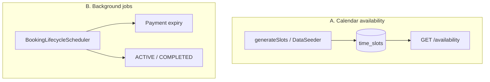
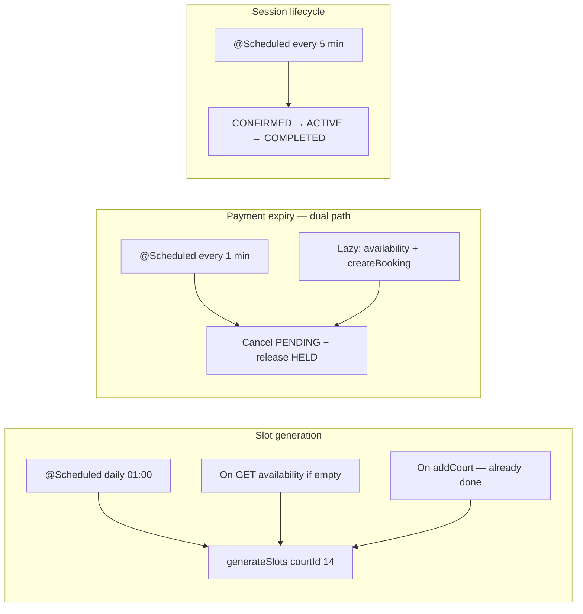

# SI-BLO Scheduling System — Revision Prompt (`fix1.md`)

> **Audience:** Developers or AI agents continuing work after `fix.md`.  
> **Project:** Spring Boot 3.4 (`com.siblo.rent`) + Thymeleaf + JWT + H2  
> **Companion docs:** `fix.md` (booking core fixes — largely implemented), `Prompt.md` (design spec)  
> **Goal:** Fix the **scheduling layer**: slot generation horizon, lifecycle jobs, payment-expiry consistency, and UI alignment. Make time-based behavior correct and maintainable without rewriting the whole booking model.

---

## 0. Relationship to `fix.md`

`fix.md` targeted booking correctness (security, validation, `HELD` slots, payment, reschedule, exceptions). **Most of that is already in the codebase:**

| `fix.md` item | Status |
|---------------|--------|
| `/api/bookings/**` authenticated | Done |
| Exception package + `GlobalExceptionHandler` | Done |
| `HELD` slot status + `paymentExpiresAt` | Done |
| `BookingService` validation + contiguous slots | Done |
| `Payment` entity + `PaymentService` | Done |
| Reschedule via `PATCH` | Done |
| `BookingLifecycleScheduler` (basic) | Done — **but buggy** |
| `generateSlots` on `addCourt` | Done |
| `DataSeeder` with `slotIds` | Done |
| Frontend payment modal + `apiFetch` | Done |

**`fix1.md` does not repeat `fix.md`.** It revises and completes the **scheduling mechanism** only. Read existing files before editing; extend, don't duplicate.

---

## 1. Problem statement (scheduling-specific)

SI-BLO uses **two scheduling systems** that are only partially wired:



### A. Calendar / slot generation — gaps

| Issue | Symptom |
|-------|---------|
| No rolling horizon job | Slots exist for 14 days from last seed/add only; day 15+ is empty |
| Hour-only loop | `open.getHour() < close.getHour()` breaks non-整点 hours (e.g. 06:30–22:30) |
| No lazy generation | `GET /availability` returns empty if slots missing — no fallback |
| UI horizon mismatch | `booking.html` scroller = **10 days**; backend generates **14 days** |
| `BLOCKED` unused | Enum exists; no admin path to block slots |

### B. Background lifecycle jobs — gaps

| Issue | Symptom |
|-------|---------|
| `findAll()` in lifecycle job | Loads every booking into memory; dead query left in code |
| Same-day COMPLETED bug | `CONFIRMED` on today after `endTime` stays CONFIRMED until tomorrow |
| Missed ACTIVE window | If app is down during session, booking may skip ACTIVE entirely |
| Expiry only in background | Stale `HELD` slots block availability up to 60s after expiry |
| No shared expiry service | Duplicated release logic in scheduler vs `BookingService` |

### C. Architectural decision (locked for this project)

**Do not** rewrite to computed availability (derive free times from bookings only).  
**Do** keep **materialized `TimeSlot` rows** + **Spring `@Scheduled`** + **lazy expiry on read/write**.

This is the best fit for a UAS: single instance, ~10 courts, 14-day horizon, existing code investment.

**Do not add:** Quartz, Redis delayed queues, pg_cron, or multi-instance job coordination.

---

## 2. Target scheduling architecture



### Scheduling mechanism choice

| Layer | Mechanism | Why |
|-------|-----------|-----|
| Slot grid | Materialized `time_slots` rows | Already built; fast reads; clear demo |
| Horizon extension | `@Scheduled(cron)` daily + lazy on read | No manual admin action needed |
| Payment expiry | 1-min poll **+** lazy on API | Correct UX without Quartz |
| ACTIVE/COMPLETED | 5-min poll with **targeted DB queries** | Good enough for UAS |
| Exact per-booking timers | **Out of scope** | Optional polish; not required |

---

## 3. Constraints

1. **Extend existing classes** — prefer `BookingExpiryService`, `SlotGenerationService`, or methods on `CourtService`/`BookingService` over new frameworks.
2. **Single JVM** — `@Scheduled` is fine; no distributed locks.
3. **Config-driven** — add properties in `application.properties` (see §4.1).
4. **Idempotent jobs** — safe to run twice; `generateSlots` already skips existing start times.
5. **Transactional** — each scheduled method stays `@Transactional`; extract shared logic into services called by both scheduler and controllers.
6. **Tests required** — see §9.

---

## 4. Configuration (`application.properties`)

Add:

```properties
# Scheduling (fix1)
app.scheduling.slot-horizon-days=14
app.scheduling.slot-extend-cron=0 0 1 * * *
app.scheduling.payment-expiry-fixed-rate-ms=60000
app.scheduling.lifecycle-fixed-rate-ms=300000
app.scheduling.date-scroller-days=14
```

Use `@Value` or `@ConfigurationProperties(prefix = "app.scheduling")` in a small `SchedulingProperties` class (optional but clean).

---

## 5. Implementation phases

Execute in order. Run `./mvnw test` after each phase.

---

### Phase 1 — Extract shared scheduling services

**Goal:** One place for expiry and slot release; scheduler and API both call it.

#### 5.1.1 Create `BookingExpiryService.java`

Path: `com.siblo.rent.service.BookingExpiryService`

```java
@Service
public class BookingExpiryService {

    @Transactional
    public int expirePendingPayments() {
        // find PENDING_PAYMENT where paymentExpiresAt < now
        // for each: releaseSlots (HELD → AVAILABLE), status CANCELLED
        // return count expired
    }

    @Transactional
    public void expirePendingPaymentsForCourtAndDate(Long courtId, LocalDate date) {
        // Same logic, scoped to bookings on that court+date (for lazy availability)
    }

    private void releaseHeldSlots(Booking booking) { ... }
}
```

Move slot-release logic out of `BookingLifecycleScheduler.processExpiredPayments()` into this service.

#### 5.1.2 Create `BookingLifecycleService.java`

Path: `com.siblo.rent.service.BookingLifecycleService`

```java
@Service
public class BookingLifecycleService {

    @Transactional
    public int advanceLifecycle() {
        // Apply state machine (§5.3.2); return number of bookings updated
    }
}
```

**Do not** use `bookingRepository.findAll()`.

#### 5.1.3 Refactor `BookingService.createBooking()`

At the **start** of `createBooking`, before locking slots:

```java
bookingExpiryService.expirePendingPaymentsForCourtAndDate(request.getCourtId(), date);
```

Ensures stale holds on that court/date are cleared before a new booking attempt.

---

### Phase 2 — Fix `generateSlots` + rolling horizon

#### 5.2.1 Fix hour loop in `CourtService.generateSlots()`

Replace integer hour loop with `LocalTime` stepping:

```java
LocalTime slotStart = open.withMinute(0).withSecond(0).withNano(0);
if (open.getMinute() > 0 || open.getSecond() > 0) {
    slotStart = open.getHour() < close.getHour()
        ? open.withMinute(0).plusHours(1) : open;
}
while (slotStart.plusHours(1).compareTo(close) <= 0
       || (slotStart.isBefore(close) && slotStart.plusHours(1).isAfter(close))) {
    // simpler rule: while slotStart.isBefore(close):
    LocalTime slotEnd = slotStart.plusHours(1);
    if (slotEnd.isAfter(close)) break;
    // exists check + save AVAILABLE slot
    slotStart = slotEnd;
}
```

**Rule:** Create 1-hour slots where `startTime >= open` and `endTime <= close`. Default open/close: 06:00–22:00.

Apply the same loop in `DataSeeder` (duplicate logic → call `courtService.generateSlots` per court after seed, or extract `SlotGenerator` helper used by both).

#### 5.2.2 Create `SlotMaintenanceScheduler.java`

Path: `com.siblo.rent.scheduler.SlotMaintenanceScheduler`

```java
@Component
public class SlotMaintenanceScheduler {

    @Scheduled(cron = "${app.scheduling.slot-extend-cron:0 0 1 * * *}")
    @Transactional
    public void extendSlotHorizon() {
        List<Court> activeCourts = courtRepository.findByStatus(CourtStatus.ACTIVE);
        for (Court court : activeCourts) {
            courtService.generateSlots(court.getId(), horizonDays);
        }
    }
}
```

#### 5.2.3 Lazy generation on availability read

In `CourtService.getAvailability(Long courtId, LocalDate date)`:

```java
List<TimeSlot> slots = timeSlotRepository.findByCourtIdAndDateOrderByStartTime(courtId, date);
if (slots.isEmpty()) {
    Court court = courtRepository.findById(courtId).orElseThrow(...);
    if (court.getStatus() == ACTIVE && !date.isBefore(LocalDate.now())) {
        generateSlots(courtId, horizonDays);
        slots = timeSlotRepository.findByCourtIdAndDateOrderByStartTime(courtId, date);
    }
}
bookingExpiryService.expirePendingPaymentsForCourtAndDate(courtId, date);
return slots.stream().map(TimeSlotDTO::fromEntity).collect(...);
```

---

### Phase 3 — Fix lifecycle state machine

#### 5.3.1 Add repository queries (`BookingRepository.java`)

```java
List<Booking> findByStatus(BookingStatus status);

@Query("""
    SELECT b FROM Booking b
    WHERE b.status = 'CONFIRMED'
      AND (b.date < :today OR (b.date = :today AND b.endTime <= :now))
    """)
List<Booking> findConfirmedReadyToComplete(@Param("today") LocalDate today, @Param("now") LocalTime now);

@Query("""
    SELECT b FROM Booking b
    WHERE b.status = 'CONFIRMED'
      AND b.date = :today
      AND b.startTime <= :now AND b.endTime > :now
    """)
List<Booking> findConfirmedReadyToActivate(@Param("today") LocalDate today, @Param("now") LocalTime now);

@Query("""
    SELECT b FROM Booking b
    WHERE b.status = 'ACTIVE'
      AND (b.date < :today OR (b.date = :today AND b.endTime <= :now))
    """)
List<Booking> findActiveReadyToComplete(@Param("today") LocalDate today, @Param("now") LocalTime now);
```

#### 5.3.2 State machine (implement in `BookingLifecycleService`)

Use `LocalDate today` and `LocalTime now` (server timezone; document as `Asia/Jakarta` if you add `app.timezone` later).

| Current | Condition | New | Slot action |
|---------|-----------|-----|-------------|
| `CONFIRMED` | `date < today` OR (`date == today` AND `now >= endTime`) | `COMPLETED` | Release slots → `AVAILABLE` |
| `CONFIRMED` | `date == today` AND `startTime <= now < endTime` | `ACTIVE` | Keep `BOOKED` |
| `ACTIVE` | `date < today` OR (`date == today` AND `now >= endTime`) | `COMPLETED` | Release slots → `AVAILABLE` |

**Fixes the same-day bug:** session ending at 19:00 completes same evening, not next day.

**Edge case — missed ACTIVE:** If `now >= endTime` and status is still `CONFIRMED`, go directly to `COMPLETED` (skip ACTIVE). Do not leave orphaned CONFIRMED.

#### 5.3.3 Slim down `BookingLifecycleScheduler.java`

```java
@Scheduled(fixedRateString = "${app.scheduling.payment-expiry-fixed-rate-ms:60000}")
public void processExpiredPayments() {
    bookingExpiryService.expirePendingPayments();
}

@Scheduled(fixedRateString = "${app.scheduling.lifecycle-fixed-rate-ms:300000}")
public void updateBookingLifecycle() {
    bookingLifecycleService.advanceLifecycle();
}
```

**Delete:** `findAll()` stream, dead `findByStatusAndPaymentExpiresAtBefore(CONFIRMED, ...)` query, inline release logic (delegated to services).

---

### Phase 4 — Frontend alignment

#### 5.4.1 `booking.html` date scroller

Change:

```javascript
for (let i = 0; i < 10; i++) {
```

To read horizon from server or constant **14** (match `app.scheduling.date-scroller-days`):

**Option A (simple):** Thymeleaf inject:

```html
<script th:inline="javascript">
const DATE_SCROLLER_DAYS = /*[[${dateScrollerDays}]]*/ 14;
</script>
```

Pass `dateScrollerDays` from `PageController.booking()` via `@Value`.

**Option B:** Hardcode `14` with comment linking to `application.properties`.

#### 5.4.2 Availability loading

After `loadSlots` fetch, if empty and date is in horizon, show: *"No slots yet — try again in a moment"* (lazy gen should populate on second fetch). Optional: single automatic retry after 500ms.

#### 5.4.3 Payment expiry display

If `paymentExpiresAt` is in API response, countdown in modal is already present — ensure `BookingDTO` exposes it (should exist post-`fix.md`).

---

### Phase 5 — Optional admin slot blocking (low priority)

If time permits:

- `PATCH /api/admin/courts/{courtId}/slots/{slotId}` body `{ "status": "BLOCKED" }`
- `booking.html` already treats `BLOCKED` as unavailable

Skip if behind schedule; document as future work.

---

## 6. Files to create

| File | Purpose |
|------|---------|
| `service/BookingExpiryService.java` | Centralized payment expiry + slot release |
| `service/BookingLifecycleService.java` | CONFIRMED/ACTIVE/COMPLETED transitions |
| `scheduler/SlotMaintenanceScheduler.java` | Daily rolling slot horizon |
| `config/SchedulingProperties.java` | Optional config binding |
| `test/.../BookingLifecycleServiceTest.java` | State machine unit tests |
| `test/.../BookingExpiryServiceTest.java` | Expiry unit tests |
| `test/.../SlotGenerationTest.java` | `generateSlots` edge cases |

## 7. Files to modify

| File | Changes |
|------|---------|
| `CourtService.java` | Fix `generateSlots` loop; lazy gen + lazy expiry in `getAvailability` |
| `BookingLifecycleScheduler.java` | Delegate to services; remove `findAll` |
| `BookingRepository.java` | Targeted lifecycle queries (§5.3.1) |
| `BookingService.java` | Call expiry before `createBooking` |
| `DataSeeder.java` | Use shared `generateSlots` (remove duplicate loop) |
| `PageController.java` | Pass `dateScrollerDays` to booking page |
| `booking.html` | Scroller days = 14 (or config) |
| `application.properties` | Scheduling config keys (§4) |

---

## 8. Business rules (scheduling)

| Rule | Enforcement |
|------|-------------|
| 14-day booking horizon | Daily job + lazy gen + UI scroller |
| 1-hour slots within court open/close | Fixed `generateSlots` |
| `HELD` released on expiry | Poll + lazy on availability + before create |
| `COMPLETED` same day after `endTime` | Fixed lifecycle query |
| `ACTIVE` during `startTime <= now < endTime` on booking date | Lifecycle service |
| Slots reusable after session | `releaseSlotsForDate` on COMPLETED |
| Idempotent slot creation | `existsByCourtIdAndDateAndStartTime` |

---

## 9. Acceptance criteria

### Slot generation
- [ ] New court still gets 14 days of slots on create (regression)
- [ ] Daily job extends horizon without duplicating slots
- [ ] `GET /availability` for day 15+ (after job) returns slots OR lazy-generates on first request
- [ ] Court with `openTime=06:30`, `closeTime=22:00` gets correct slots (not empty/wrong)

### Payment expiry
- [ ] Expired `PENDING_PAYMENT` cancelled within ~1 min by scheduler
- [ ] Expired hold released **immediately** when user loads availability (lazy)
- [ ] Expired hold released before `createBooking` on same court/date

### Lifecycle
- [ ] `CONFIRMED` booking today, `now > endTime` → `COMPLETED` same day (not tomorrow)
- [ ] `CONFIRMED` during session window → `ACTIVE`
- [ ] `ACTIVE` after `endTime` → `COMPLETED`; slots `AVAILABLE`
- [ ] Past-date `CONFIRMED` → `COMPLETED`
- [ ] Lifecycle job does **not** call `findAll()`

### UI
- [ ] Date scroller shows 14 days (matches backend horizon)
- [ ] Day 11–14 selectable and loads slots

### Tests
- [ ] Unit: lifecycle transitions (table in §5.3.2)
- [ ] Unit: `expirePendingPayments` releases HELD slots
- [ ] Unit: `generateSlots` respects open/close with minutes
- [ ] Integration: availability after lazy gen returns non-empty for ACTIVE court

---

## 10. Manual QA script

1. Start app; note court id and a date on day 12 of scroller.
2. Confirm 14 date cards visible (not 10).
3. Select day 12 — slots load (lazy gen OK if first visit after clean DB).
4. Create `PENDING_PAYMENT` booking; wait 16 min OR set `payment-timeout-minutes=1` temporarily.
5. Reload availability — slots must be `AVAILABLE` without waiting for scheduler.
6. Create + pay booking for today ending in 1 hour; after `endTime`, within 5 min status → `COMPLETED`.
7. Check admin timeline — booking shows correct status transitions.
8. Restart app (H2 reset); verify seeder + `generateSlots` still produce consistent data.

---

## 11. Test skeleton

```java
@ExtendWith(MockitoExtension.class)
class BookingLifecycleServiceTest {

    @Mock BookingRepository bookingRepository;
    @Mock TimeSlotRepository timeSlotRepository;
    @InjectMocks BookingLifecycleService service;

    @Test
    void confirmedToday_afterEndTime_becomesCompleted() {
        LocalDate today = LocalDate.now();
        Booking b = booking(today, LocalTime.of(18, 0), LocalTime.of(19, 0), CONFIRMED);
        when(bookingRepository.findConfirmedReadyToComplete(today, LocalTime.of(20, 0)))
            .thenReturn(List.of(b));

        service.advanceLifecycle();

        assertEquals(COMPLETED, b.getStatus());
        verify(timeSlotRepository).saveAll(argThat(slots ->
            slots.stream().allMatch(s -> s.getStatus() == AVAILABLE)));
    }
}
```

```java
@SpringBootTest
@AutoConfigureMockMvc
class AvailabilityLazyGenerationTest {

    @Test
    void availability_emptyDate_lazyGeneratesSlots() throws Exception {
        // add court, do NOT pre-seed slots for target date, GET availability → non-empty
    }
}
```

---

## 12. Implementation notes for agents

1. **Read current code first** — `fix.md` work is already merged; don't re-add `HELD`, `Payment`, etc.
2. **Extract services before fixing scheduler** — avoids duplicate release logic.
3. **Keep `BookingLifecycleScheduler` thin** — it's a cron adapter only.
4. **Same transaction boundaries** — lazy expiry inside `getAvailability` must be `@Transactional` on `CourtService` method.
5. **H2 `create-drop`** — daily cron won't fire across restarts in dev; lazy generation is critical for testing horizon.
6. **Do not introduce Quartz** — out of scope for this revision.
7. **Run** `./mvnw test` and manual QA §10 when done.

---

## 13. Out of scope (`fix1.md`)

- Rewrite to computed availability (no `time_slots` table)
- Quartz / Redis / distributed scheduling
- Multi-timezone per venue
- Per-booking `TaskScheduler` one-shot timers
- Week-view admin calendar
- PostgreSQL migration

---

## 14. Success statement

When `fix1.md` is complete:

- Users can book any day within a **rolling 14-day window** without admin manually generating slots.
- Expired payment holds disappear **promptly** (lazy + background), not up to 60 seconds late in the UI.
- Booking status reflects reality **same day** (ACTIVE during play, COMPLETED after `endTime`).
- Background jobs use **targeted queries**, not full table scans.
- UI and backend agree on the **14-day** horizon.

---

## 15. Changelog vs `fix.md`

| Topic | `fix.md` | `fix1.md` revision |
|-------|----------|-------------------|
| Slot model | Introduce `HELD` | Keep; add lazy expiry on read |
| Scheduler | Basic `@Scheduled` | Extract services; fix state machine |
| Slot generation | `generateSlots` on addCourt | + daily roll + lazy + fix time loop |
| Lifecycle | CONFIRMED → ACTIVE → COMPLETED | Fix same-day COMPLETED; targeted queries |
| UI | Payment modal | + 14-day scroller alignment |
| Mechanism | Implied polling | **Explicit:** materialized slots + `@Scheduled` + lazy expiry |
