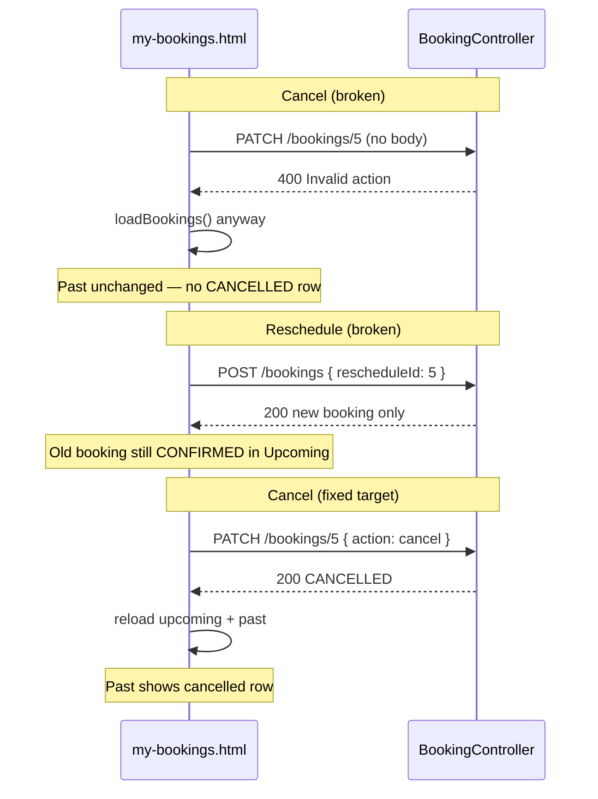

# SI-BLO My Bookings UI — Fix Prompt (`fix3.md`)

> **Audience:** Developers or AI agents fixing the My Bookings page refresh and action wiring.  
> **Project:** Spring Boot 3.4 (`com.siblo.rent`) + Thymeleaf + JWT  
> **Companion docs:** `fix.md` (booking core), `fix1.md` (scheduling layer), `Prompt.md` (design spec)  
> **Goal:** Make **Upcoming** and **Past Bookings** update correctly after Pay Now, Cancel, and Reschedule — and keep both sections in sync with the backend.

---

## 0. User-reported symptom

> "The past booking table doesn't change when I Pay Now, Cancel, or Reschedule."

**Partially expected, partially broken:**

| Action | Expected UI behavior | What actually happens |
|--------|----------------------|------------------------|
| **Pay Now** | Booking stays in **Upcoming** (status → `CONFIRMED`); **Past** unchanged | Upcoming *should* update; Past correctly empty for this action |
| **Cancel** | Booking leaves Upcoming → appears in **Past** as `CANCELLED` | **Cancel API never succeeds** → Past never updates |
| **Reschedule** | Old booking → **Past** as `CANCELLED`; new booking → **Upcoming** | **Reschedule API never called** → old stays Upcoming; duplicate new booking may appear |

**Root cause:** Backend cancel/reschedule endpoints exist and work, but **frontend calls them incorrectly**. The Past table filter is also **out of sync** with the backend `findPast` query.

---

## 1. Root cause analysis

### Bug A — Cancel sends PATCH with no body (critical)

**Files:** `my-bookings.html` (lines 150–158), `booking.html` `cancelPayment()` (lines 369–378)

**Current code (`my-bookings.html`):**

```javascript
fetch(`/api/bookings/${id}`, {
    method: 'PATCH',
    headers: { 'Authorization': 'Bearer ' + token }
})
```

**Backend requires (`BookingController.java`):**

```java
@PatchMapping("/{id}")
public ResponseEntity<?> updateBooking(@PathVariable Long id, @RequestBody BookingUpdateRequest body, ...) {
    if ("cancel".equals(body.getAction())) {
        return ResponseEntity.ok(bookingService.cancelBooking(id, user.getId()));
    }
    ...
}
```

Without `Content-Type: application/json` and body `{ "action": "cancel" }`:
- Request fails (400 / null body / `Invalid action: null`)
- Frontend still calls `loadBookings()` without checking `response.ok` → **UI looks unchanged**
- Booking status in DB stays `PENDING_PAYMENT` or `CONFIRMED` → **never appears in Past**

---

### Bug B — Reschedule never hits the backend (critical)

**File:** `booking.html` `confirmBooking()` (lines 314–322)

**Current code:**

```javascript
let url = '/api/bookings';
let body = { courtId, slotIds, date };
if (rescheduleId) {
    body.rescheduleId = parseInt(rescheduleId);  // ignored by server
}
fetch(url, { method: 'POST', ... body })
```

**Problems:**

1. `BookingRequest` has **no `rescheduleId` field** — Jackson drops it.
2. Flow always `POST /api/bookings` → creates a **new** booking only.
3. `BookingService.rescheduleBooking()` (PATCH with `action: "reschedule"`) is **never invoked**.
4. Old booking stays `CONFIRMED` in Upcoming; old row never moves to Past as `CANCELLED`.

**Also:** `rescheduleBooking()` in `my-bookings.html` navigates to `/booking?reschedule={id}` **without `courtId`** — user may land on wrong court.

---

### Bug C — Pay Now: upcoming may not visibly change (minor)

Pay calls `POST /api/bookings/{id}/pay` correctly. On success, `loadBookings()` runs.

Issues:
- No `response.ok` check before `loadBookings()` in cancel path; pay path checks `data.error` only.
- User watches **Past** table — Pay does not add rows there (correct by design). Needs clearer UX or they perceive it as "nothing changed."

---

### Bug D — Client-side Past filter ≠ backend Past query (moderate)

**Frontend (`my-bookings.html`):**

```javascript
const past = bookings.filter(b =>
    b.status === 'COMPLETED' || b.status === 'CANCELLED'
);
```

**Backend (`BookingRepository.findPast`):**

```sql
status IN ('COMPLETED','CANCELLED')
OR (status = 'CONFIRMED' AND date < today)
```

Frontend **misses** past-date `CONFIRMED` bookings that backend would include in `?past=true`.

**Also:** Page uses `GET /api/bookings/me` (all) + client filter instead of:
- `GET /api/bookings/me?upcoming=true`
- `GET /api/bookings/me?past=true`

---

### Bug E — Weak error handling hides failures (moderate)

```javascript
.then(r => r.json())
.then(() => { loadBookings(); })  // cancel — no ok check
```

```javascript
.catch(() => {
    document.getElementById('upcomingGrid').innerHTML = 'Failed...';
    // pastBookingsBody NOT updated — stale Past table
});
```

Failed actions silently "refresh" with same data → user thinks table is broken.

---

### Bug F — No reload when returning from booking page (minor)

`reschedule` / `pay` redirect to `/my-bookings` via `window.location.href` — full page load should run `DOMContentLoaded` → `loadBookings()`.

If user uses browser **back** instead of redirect, or bfcache restores old page, list can be stale. Add `pageshow` handler as safety net.

---

### Summary diagram



---

## 2. Constraints

1. **Do not change business rules** — Pay → Upcoming; Cancel → Past; Reschedule → old Past + new Upcoming.
2. **Keep JWT auth** — `Authorization: Bearer` from `localStorage`.
3. **Prefer server-side filters** — use `?upcoming=true` and `?past=true` as source of truth.
4. **Shared `apiFetch` helper** — one implementation in `my-bookings.html`; mirror critical fixes in `booking.html` or extract to `static/js/api.js` if you prefer (optional).
5. **Minimal backend changes** — mostly frontend; small backend improvements listed in §5 are optional but recommended.
6. **Tests** — add integration test for PATCH cancel body requirement.

---

## 3. Target behavior (definition of done)

| Action | API call | Upcoming after | Past after |
|--------|----------|----------------|------------|
| Pay Now | `POST /api/bookings/{id}/pay` | Same card, status `CONFIRMED`, no Pay button | Unchanged |
| Cancel | `PATCH /api/bookings/{id}` `{ "action": "cancel" }` | Card removed | New row `CANCELLED` |
| Reschedule | `PATCH /api/bookings/{id}` `{ "action": "reschedule", courtId, slotIds, date }` | New booking card | Old booking `CANCELLED` |
| Page load / return | `GET .../me?upcoming=true` + `GET .../me?past=true` | Fresh data | Fresh data |

---

## 4. Implementation phases

Execute in order. Run `./mvnw test` after backend changes.

---

### Phase 1 — Shared `apiFetch` + dual-endpoint load

**File:** `src/main/resources/templates/my-bookings.html`

#### 4.1.1 Add `apiFetch`

```javascript
async function apiFetch(url, options = {}) {
    const headers = { 'Content-Type': 'application/json', ...(options.headers || {}) };
    if (token) headers['Authorization'] = 'Bearer ' + token;
    const response = await fetch(url, { ...options, headers });
    let data = null;
    try { data = await response.json(); } catch (_) { data = {}; }
    if (response.status === 401) {
        window.location.href = '/login';
        return null;
    }
    if (!response.ok) {
        throw new Error(data.error || data.message || `Request failed (${response.status})`);
    }
    return data;
}
```

#### 4.1.2 Replace `loadBookings()` with parallel server filters

```javascript
async function loadBookings() {
    if (!token) { /* existing login prompt */ return; }

    const upcomingGrid = document.getElementById('upcomingGrid');
    const pastBody = document.getElementById('pastBookingsBody');
    upcomingGrid.innerHTML = '<p style="color: var(--color-text-secondary);">Loading...</p>';
    pastBody.innerHTML = '<tr><td colspan="5" style="text-align: center; color: var(--color-text-secondary);">Loading...</td></tr>';

    try {
        const [upcoming, past, all] = await Promise.all([
            apiFetch('/api/bookings/me?upcoming=true'),
            apiFetch('/api/bookings/me?past=true'),
            apiFetch('/api/bookings/me')
        ]);
        renderUpcoming(upcoming);
        renderPast(past);
        renderStats(all);
    } catch (err) {
        upcomingGrid.innerHTML = `<p style="color: var(--color-text-secondary);">${err.message}</p>`;
        pastBody.innerHTML = `<tr><td colspan="5" style="text-align: center; color: var(--color-text-secondary);">${err.message}</td></tr>`;
    }
}
```

Split rendering into `renderUpcoming(bookings)`, `renderPast(bookings)`, `renderStats(allBookings)`.

#### 4.1.3 Fix "This month" stat

```javascript
function renderStats(allBookings) {
    const now = new Date();
    const month = now.getMonth();
    const year = now.getFullYear();
    const thisMonth = allBookings.filter(b => {
        if (b.status === 'CANCELLED') return false;
        const d = new Date(b.date + 'T12:00:00');
        return d.getMonth() === month && d.getFullYear() === year;
    });
    document.getElementById('thisMonthCount').textContent = thisMonth.length;
    document.getElementById('upcomingCount').textContent =
        document.querySelectorAll('#upcomingGrid .booking-card:not(.empty-state-card)').length
        || 0; // or pass upcoming.length from loadBookings
}
```

Use `upcoming.length` from API response directly for `upcomingCount`.

#### 4.1.4 Add `pageshow` reload

```javascript
document.addEventListener('DOMContentLoaded', loadBookings);
window.addEventListener('pageshow', (e) => {
    if (e.persisted) loadBookings(); // bfcache back navigation
});
```

---

### Phase 2 — Fix Cancel action

**File:** `my-bookings.html`

```javascript
async function cancelBooking(id) {
    if (!confirm('Cancel this booking?')) return;
    try {
        await apiFetch(`/api/bookings/${id}`, {
            method: 'PATCH',
            body: JSON.stringify({ action: 'cancel' })
        });
        await loadBookings(); // refreshes BOTH upcoming and past
    } catch (err) {
        alert(err.message || 'Failed to cancel booking.');
    }
}
```

**File:** `booking.html` — fix `cancelPayment()`:

```javascript
async function cancelPayment() {
    document.getElementById('paymentModal').style.display = 'none';
    if (pendingBookingId) {
        const token = localStorage.getItem('token');
        try {
            await fetch(`/api/bookings/${pendingBookingId}`, {
                method: 'PATCH',
                headers: {
                    'Content-Type': 'application/json',
                    'Authorization': 'Bearer ' + token
                },
                body: JSON.stringify({ action: 'cancel' })
            });
        } catch (_) { /* still redirect */ }
    }
    window.location.href = '/my-bookings';
}
```

---

### Phase 3 — Fix Reschedule flow

#### 4.3.1 `my-bookings.html` — pass courtId in URL

```javascript
function rescheduleBooking(bookingId, courtId) {
    window.location.href = '/booking?courtId=' + courtId + '&reschedule=' + bookingId;
}
```

Update button onclick:

```html
onclick="rescheduleBooking(${b.id}, ${b.courtId})"
```

#### 4.3.2 `booking.html` — use PATCH for reschedule

Replace `confirmBooking()` reschedule branch:

```javascript
async function confirmBooking() {
    // ... validation ...
    const token = localStorage.getItem('token');
    if (!token) { alert('Please login first.'); window.location.href = '/login'; return; }

    const payload = {
        action: 'reschedule',
        courtId: courtId,
        slotIds: selectedSlots,
        date: selectedDate
    };

    try {
        let data;
        if (rescheduleId) {
            data = await apiFetch(`/api/bookings/${rescheduleId}`, {
                method: 'PATCH',
                body: JSON.stringify(payload)
            });
        } else {
            data = await apiFetch('/api/bookings', {
                method: 'POST',
                body: JSON.stringify({ courtId, slotIds: selectedSlots, date: selectedDate })
            });
            if (data.status === 'PENDING_PAYMENT') {
                showPaymentModal(data);
                return;
            }
        }
        alert(rescheduleId ? 'Booking rescheduled!' : 'Booking confirmed!');
        window.location.href = '/my-bookings';
    } catch (err) {
        alert(err.message || 'Booking failed.');
    }
}
```

Add `apiFetch` to `booking.html` (copy or shared `static/js/api.js`).

#### 4.3.3 Reschedule UI banner

When `rescheduleId` is set, show banner at top of booking page:

```html
<div id="rescheduleBanner" style="display:none; ...">
  Rescheduling booking #<span id="rescheduleBannerId"></span> — pick a new date and time.
</div>
```

Show on `DOMContentLoaded` if `rescheduleId` present.

#### 4.3.4 Backend guard (recommended)

**File:** `BookingService.rescheduleBooking()`

Only allow reschedule when old status is `CONFIRMED` or `PENDING_PAYMENT`:

```java
if (oldBooking.getStatus() != BookingStatus.CONFIRMED
        && oldBooking.getStatus() != BookingStatus.PENDING_PAYMENT) {
    throw new BookingException("Only confirmed or pending bookings can be rescheduled");
}
```

---

### Phase 4 — Fix Pay Now feedback

**File:** `my-bookings.html`

```javascript
async function payBooking(id) {
    const btn = event.target;
    btn.disabled = true;
    btn.textContent = 'Processing...';
    try {
        await apiFetch(`/api/bookings/${id}/pay`, { method: 'POST' });
        await loadBookings();
        // Optional toast instead of alert:
        // showToast('Payment successful — booking confirmed.');
    } catch (err) {
        alert(err.message || 'Payment failed.');
        btn.disabled = false;
        btn.textContent = 'Pay Now';
    }
}
```

**UX note:** After pay, Upcoming card should show `Confirmed` without Pay/Cancel buttons. Past table stays same — **this is correct**. Optional subtitle under Past heading:

> "Completed and cancelled sessions appear here."

---

### Phase 5 — Backend hardening (recommended)

#### 4.5.1 `BookingController` — default PATCH action for backward compat (optional)

If `body.getAction()` is null, treat as cancel when body is empty — **or** reject with clear error. Prefer fixing frontend; optionally add:

```java
@ExceptionHandler(HttpMessageNotReadableException.class)
public ResponseEntity<?> handleMissingBody(...) {
    return ResponseEntity.badRequest().body(Map.of("error", "Request body required with action: cancel or reschedule"));
}
```

#### 4.5.2 `BookingDTO` — ensure date/time serialize consistently

Frontend displays `b.date`, `b.startTime`. Verify Jackson serializes `LocalDate` as `YYYY-MM-DD` and `LocalTime` as `HH:mm:ss` — format in `renderPast` if needed:

```javascript
function formatTime(t) { return t ? t.substring(0, 5) : ''; }
function formatDate(d) { /* optional locale formatting */ return d; }
```

#### 4.5.3 Integration test

**File:** `src/test/java/com/siblo/rent/controller/BookingControllerTest.java`

```java
@Test
void patchCancel_withBody_cancelsBooking() throws Exception {
    // login, create booking, PATCH { "action": "cancel" }, assert CANCELLED
}

@Test
void patchCancel_withoutBody_returns400() throws Exception {
    mockMvc.perform(patch("/api/bookings/1").header("Authorization", "Bearer " + token))
        .andExpect(status().isBadRequest());
}

@Test
void patchReschedule_cancelsOldAndCreatesNew() throws Exception {
    // CONFIRMED booking → PATCH reschedule → old CANCELLED, new CONFIRMED in DB
}
```

---

### Phase 6 — Past table polish

#### 4.6.1 Status labels

Map status to human-readable + CSS class:

| Status | Label | Dot class |
|--------|-------|-----------|
| `CANCELLED` | Cancelled | `cancelled` |
| `COMPLETED` | Completed | `completed` |
| `CONFIRMED` (past date) | Missed / Past | `confirmed` |

#### 4.6.2 Sort

Past from API is `ORDER BY date DESC` — keep as returned; do not re-sort client-side.

#### 4.6.3 Empty states

- Past empty: "No past bookings yet."
- After cancel: row should appear without full page confusion.

---

## 5. Files to modify

| File | Changes |
|------|---------|
| `my-bookings.html` | `apiFetch`, dual API load, fix cancel/pay/reschedule, `pageshow`, stats |
| `booking.html` | Fix reschedule PATCH, fix `cancelPayment` body, `apiFetch`, reschedule banner |
| `BookingService.java` | Reschedule status guard (optional) |
| `GlobalExceptionHandler.java` | Missing body error message (optional) |
| `BookingControllerTest.java` | PATCH cancel/reschedule tests (new) |

**Optional:** `src/main/resources/static/js/api.js` — shared fetch helper used by both pages.

---

## 6. Acceptance criteria

### Cancel
- [ ] Click Cancel on `PENDING_PAYMENT` → confirm → card removed from Upcoming
- [ ] Same booking appears in Past with status `CANCELLED`
- [ ] Network tab shows `PATCH /api/bookings/{id}` with body `{"action":"cancel"}` → 200

### Pay Now
- [ ] Click Pay on `PENDING_PAYMENT` → card shows `CONFIRMED` in Upcoming
- [ ] Past table unchanged (no new row) — correct behavior
- [ ] Pay button removed after success

### Reschedule
- [ ] Reschedule from My Bookings opens booking page with correct `courtId` + `reschedule` param
- [ ] Confirm sends `PATCH` with `action: "reschedule"` → old booking `CANCELLED` in Past
- [ ] New booking appears in Upcoming (`CONFIRMED` if old was confirmed)

### Reload
- [ ] `loadBookings()` fetches `?upcoming=true` AND `?past=true` separately
- [ ] Failed API shows error in **both** sections (not stale Past)
- [ ] Browser back to My Bookings refreshes list (`pageshow`)

### Regression
- [ ] New booking flow (no reschedule) still uses `POST /api/bookings`
- [ ] Payment modal on booking page still works
- [ ] `./mvnw test` passes

---

## 7. Manual QA script

1. Login as `john@siblo.com` / `john123` → `/my-bookings`.
2. Note Past table row count.
3. Cancel a `PENDING_PAYMENT` booking → Past count +1, Upcoming count -1.
4. Pay a remaining `PENDING_PAYMENT` → stays Upcoming as `CONFIRMED`; Past unchanged.
5. Reschedule a `CONFIRMED` booking → pick new slots → confirm.
6. Past shows old booking `CANCELLED`; Upcoming shows new `CONFIRMED`.
7. Open DevTools → verify no `PATCH` without JSON body.
8. From booking page, cancel payment modal → old pending booking cancelled → appears in Past.

---

## 8. Why Pay doesn't change Past (document for QA/users)

**Pay Now is not supposed to move a booking to Past.** It only transitions:

`PENDING_PAYMENT` → `CONFIRMED` (still future/upcoming).

Past receives bookings when:
- User **cancels** (`CANCELLED`)
- Session **completes** (`COMPLETED` — via lifecycle scheduler)
- **Reschedule** leaves old row as `CANCELLED` in Past

If the product should show paid-but-past sessions in Past, that is already handled by `findPast` including `CONFIRMED` where `date < today` — using `?past=true` fixes that without waiting for scheduler.

---

## 9. Out of scope

- Rewriting My Bookings as SPA / React
- WebSocket live updates
- Toast notification library (alerts OK for UAS)
- Changes to `fix1.md` scheduling jobs
- Admin timeline page

---

## 10. Success statement

After `fix3.md` is implemented:

- **Cancel** immediately moves bookings to the Past table.
- **Reschedule** cancels the old booking (visible in Past) and shows the new one in Upcoming.
- **Pay Now** updates Upcoming in place (Past correctly unchanged).
- All actions use correct API contracts with proper error handling.
- Upcoming and Past always reflect server state via `?upcoming=true` and `?past=true`.

---

## 11. Changelog

| Issue | Root cause | Fix |
|-------|------------|-----|
| Past unchanged on Cancel | PATCH missing `{ action: "cancel" }` | Send JSON body + check response |
| Past unchanged on Reschedule | POST ignores `rescheduleId` | PATCH reschedule endpoint |
| Past missing old CONFIRMED | Client filter too narrow | Use `?past=true` from API |
| "Nothing happens" on error | `loadBookings()` on failed requests | `apiFetch` throws on `!ok` |
| Wrong court on reschedule | URL missing `courtId` | Pass `courtId` in query string |
